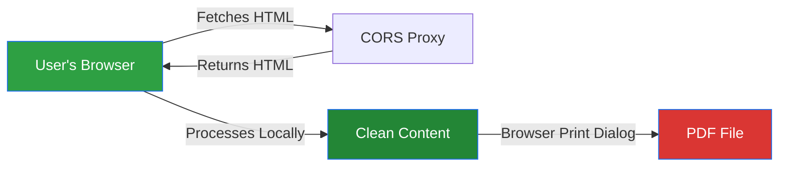
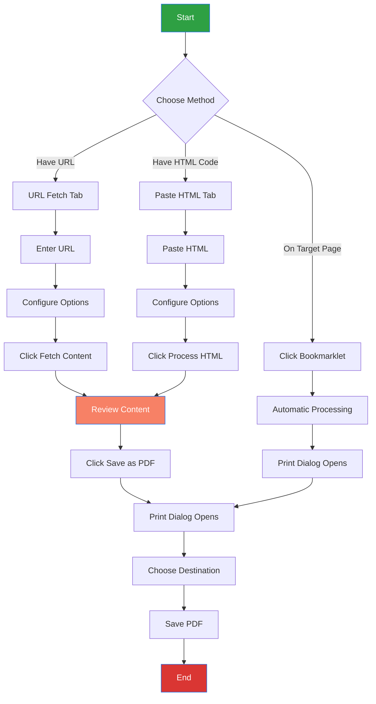
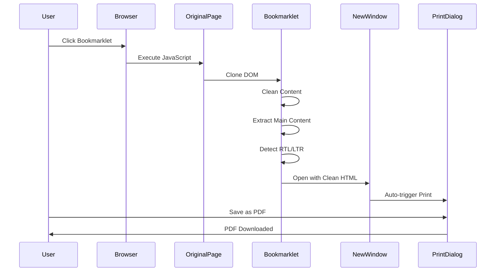
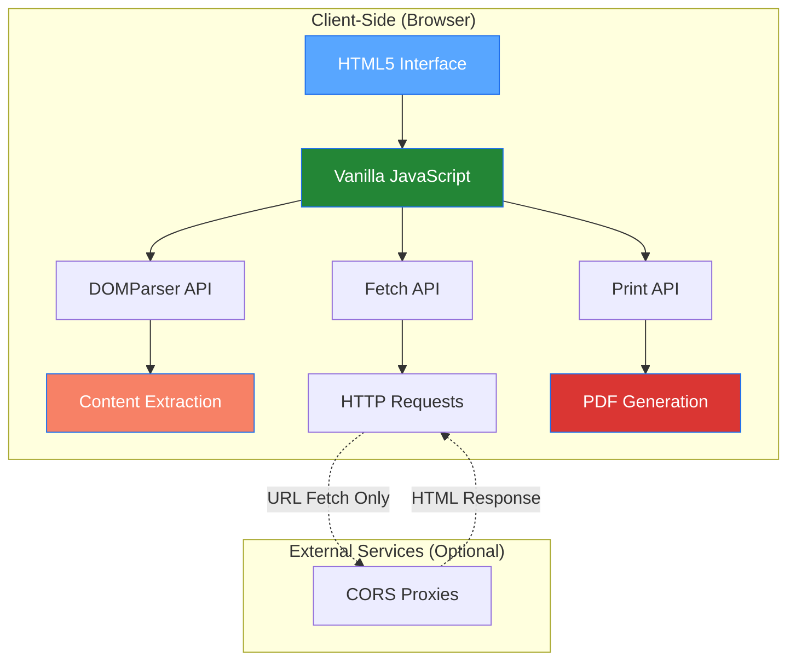

# 📄 xsukax ReadClean PDF

[](https://www.gnu.org/licenses/gpl-3.0)
[](https://github.com/xsukax/xsukax-ReadClean-PDF)
[](https://github.com/xsukax/xsukax-ReadClean-PDF/issues)

A privacy-focused, client-side web application that extracts clean, readable content from any webpage and converts it to PDF format. Built with pure HTML, CSS, and JavaScript—no backend required, no tracking, complete privacy.

## 🎯 Project Overview

**xsukax ReadClean PDF** is a lightweight, browser-based tool designed to transform cluttered web content into clean, distraction-free PDFs optimized for reading and archival. The application strips away advertisements, navigation elements, and other extraneous content while preserving the core article or document structure.

### Primary Purpose

- **Content Extraction**: Intelligently identifies and extracts main content from web pages
- **Distraction Removal**: Eliminates ads, scripts, sidebars, navigation menus, and other non-essential elements
- **PDF Generation**: Leverages native browser print functionality for high-quality PDF output
- **Universal Compatibility**: Works with any website through multiple fetching methods

### Core Functionalities

1. **URL-Based Fetching**: Retrieve content directly from web URLs using CORS proxies
2. **HTML Paste Processing**: Process raw HTML content pasted directly into the application
3. **Bookmarklet Integration**: One-click content extraction from any webpage via browser bookmarklet
4. **Intelligent Content Cleaning**: Automated removal of ads, scripts, images, links, and navigation elements
5. **RTL/LTR Language Support**: Automatic detection and proper rendering of right-to-left and left-to-right text
6. **Responsive Design**: Optimized interface for desktop and mobile devices

## 🔒 Security and Privacy Benefits

**xsukax ReadClean PDF** is architected with privacy and security as foundational principles. All processing occurs entirely within your browser, ensuring complete data sovereignty and protection.

### Privacy-Centric Architecture

#### Client-Side Processing Only
All HTML parsing, content extraction, and PDF generation occur exclusively in your browser's JavaScript environment. No data is transmitted to external servers for processing, eliminating concerns about data interception, logging, or unauthorized access.

#### No Data Collection or Tracking
- **Zero Analytics**: The application contains no analytics scripts, tracking pixels, or telemetry
- **No Cookies**: Does not set or read cookies for user identification or behavior tracking
- **No External Dependencies**: Core functionality operates without loading third-party libraries from CDNs
- **No User Accounts**: Fully functional without registration, login, or profile creation

#### Transparent Data Flow


**Note**: When using the URL Fetch method, the application routes requests through public CORS proxy services to bypass browser same-origin restrictions. While these proxies can see the URLs being fetched, they do not receive or process your extracted content. For maximum privacy, use the **Bookmarklet** or **Paste HTML** methods, which operate entirely offline.

### Security Features

#### Content Sanitization
- **Script Removal**: Automatically strips all `<script>` tags to prevent execution of potentially malicious code
- **Style Isolation**: Removes external stylesheets and inline styles that could contain tracking mechanisms
- **Iframe Elimination**: Blocks embedded iframes that might load third-party content or trackers

#### Safe HTML Processing
- Utilizes browser's native `DOMParser` for secure HTML parsing
- Prevents XSS (Cross-Site Scripting) attacks through proper content handling
- Sandboxed execution environment ensures no persistent storage or state

#### Bookmarklet Security Model
The bookmarklet operates with the same security context as the page you're visiting, ensuring:
- No data leaves your browser
- Execution occurs only when explicitly triggered by user action
- Content extraction happens in an isolated window context

### Data Sovereignty Guarantees

| Aspect | Implementation |
|--------|----------------|
| **Data Storage** | None—all processing is ephemeral and session-based |
| **Network Requests** | Only when using URL Fetch; Bookmarklet mode is 100% offline |
| **Third-Party Access** | Zero—no external services process your content |
| **Data Retention** | None—content is discarded when you close the browser tab |
| **Audit Trail** | Open source codebase—verify behavior independently |

## ✨ Features and Advantages

### Key Benefits

#### 🚀 **Zero Installation Required**
- Single HTML file—download and open in any modern browser
- No npm packages, dependencies, or build processes
- Portable—run from USB drive, local filesystem, or web server

#### 🎨 **Intelligent Content Extraction**
- Prioritizes main content areas using semantic HTML selectors (`<article>`, `<main>`, `[role="main"]`)
- Adaptive fallback mechanism for non-standard page structures
- Preserves document hierarchy and formatting

#### 🧹 **Comprehensive Cleaning Options**
- **Remove Ads & Scripts**: Eliminates advertisements, tracking scripts, and promotional content
- **Remove Images**: Strips all images for text-only output (reduces PDF size)
- **Remove Links & Buttons**: Converts hyperlinks to plain text, removes interactive elements
- **Expand All Sections**: Automatically opens collapsible elements and hidden content
- **Auto-detect RTL/LTR**: Recognizes Hebrew, Arabic, and other right-to-left scripts

#### 🌐 **Multi-Language Support**
- Unicode-aware text processing
- Automatic bidirectional text handling
- Proper rendering of mixed-direction content

#### 📱 **Responsive Interface**
- Mobile-optimized design with touch-friendly controls
- Tablet and desktop layouts
- Dark theme for reduced eye strain

#### ⚡ **Three Fetching Methods**

1. **URL Fetch**: Direct content retrieval with automatic proxy fallback
2. **Paste HTML**: Process saved HTML files or copied source code
3. **Bookmarklet**: One-click extraction from any webpage (recommended for maximum privacy)

### Unique Selling Points

| Feature | xsukax ReadClean PDF | Traditional Tools |
|---------|---------------------|-------------------|
| **Privacy** | 100% client-side, zero tracking | Often cloud-based with data collection |
| **Cost** | Free and open source | Frequently requires subscriptions |
| **Installation** | None—single HTML file | Browser extensions or desktop apps |
| **Cross-Platform** | Any device with a modern browser | Platform-specific builds |
| **Offline Capable** | Yes (Bookmarklet and Paste modes) | Usually requires internet connection |
| **Customization** | Open source—modify freely | Closed-source, limited options |
| **CORS Workaround** | Built-in proxy fallback | Manual configuration or paid services |

### Comparison with Alternatives

**vs. Browser Extensions**
- No permission requirements or security warnings
- Works in private/incognito mode without special settings
- No browser-specific compatibility issues

**vs. Online Services**
- Complete privacy—no data leaves your device (Bookmarklet mode)
- No rate limits, captchas, or service outages
- Unlimited usage without accounts or paywalls

**vs. Print Stylesheets**
- More aggressive content cleaning
- Works on sites without print-optimized CSS
- Consistent output across all websites

## 🛠️ Installation Instructions

### Method 1: Direct Download (Recommended)

1. **Download the HTML file**:
   ```bash
   # Clone the repository
   git clone https://github.com/xsukax/xsukax-ReadClean-PDF.git
   
   # Navigate to the directory
   cd xsukax-ReadClean-PDF
   ```

2. **Open in browser**:
   - **Windows**: Double-click `index.html` or right-click → Open with → [Your Browser]
   - **macOS**: Double-click `index.html` or drag to browser icon
   - **Linux**: `xdg-open index.html` or use your file manager

### Method 2: Web Server Deployment

For sharing within your organization or hosting publicly:

```bash
# Using Python's built-in HTTP server
python3 -m http.server 8000

# Using Node.js http-server
npx http-server -p 8000

# Using PHP's built-in server
php -S localhost:8000
```

Access at: `http://localhost:8000`

### Method 3: GitHub Pages (Public Hosting)

1. Fork this repository
2. Go to **Settings** → **Pages**
3. Select **main** branch as source
4. Your app will be available at: `https://[username].github.io/xsukax-ReadClean-PDF/`

### Bookmarklet Installation

1. Open `index.html` in your browser
2. Navigate to the **Bookmarklet** tab
3. Drag the "📄 xsukax ReadClean PDF" button to your bookmarks bar
4. Use on any webpage by clicking the bookmark

**Manual Bookmarklet Creation** (if drag-and-drop doesn't work):
1. Create a new bookmark in your browser
2. Set the name to "xsukax ReadClean PDF"
3. Copy the JavaScript code from the bookmarklet button
4. Paste into the URL field
5. Save

### System Requirements

- **Browser**: Any modern browser (Chrome 90+, Firefox 88+, Safari 14+, Edge 90+)
- **JavaScript**: Must be enabled
- **Screen Resolution**: 320px width minimum (mobile-friendly)
- **Internet Connection**: Required only for URL Fetch mode; Bookmarklet and Paste modes work offline

## 📖 Usage Guide

### Quick Start



### Detailed Workflows

#### Workflow 1: URL Fetch Method

**Best for**: Websites that allow CORS or when you want quick extraction

1. **Open the application** in your browser
2. **Enter the URL** in the "Website URL" field
3. **Configure cleaning options**:
   - ✅ Remove Ads & Scripts (recommended)
   - ✅ Remove Images (optional—for smaller PDFs)
   - ✅ Remove Links & Buttons (optional—for cleaner text)
   - ✅ Expand All Sections (recommended—reveals hidden content)
   - ✅ Auto-detect RTL/LTR (recommended—for proper text direction)
4. **Click "🔥 Fetch Content"**
5. **Wait for processing** (the app tries multiple proxies automatically)
6. **Review the extracted content** in the preview area
7. **Click "📄 Save as PDF (Print)"**
8. **In the print dialog**:
   - Choose "Save as PDF" as destination
   - Adjust margins if needed (recommend "Default" or "Minimum")
   - Click "Save"

**Troubleshooting**: If all proxies fail, use the Bookmarklet or Paste HTML method instead.

#### Workflow 2: Paste HTML Method

**Best for**: When you have the HTML source code or saved webpage

1. **Get the HTML source**:
   - Open target webpage
   - Press `Ctrl+U` (Windows/Linux) or `Cmd+Option+U` (macOS)
   - Or right-click → "View Page Source"
   - Select all (`Ctrl+A` or `Cmd+A`) and copy (`Ctrl+C` or `Cmd+C`)
2. **Switch to "Paste HTML" tab**
3. **Paste the HTML** into the text area
4. **Configure cleaning options** (same as URL Fetch)
5. **Click "🔄 Process HTML"**
6. **Review and save** (steps 6-8 from Workflow 1)

**Alternative**: You can also paste HTML from "Save As → Web Page, Complete" files

#### Workflow 3: Bookmarklet Method (Recommended)

**Best for**: Maximum privacy, one-click extraction, bypassing CORS restrictions

**Setup** (one-time):
1. Open the application
2. Navigate to the "Bookmarklet" tab
3. Drag the "📄 xsukax ReadClean PDF" button to your bookmarks bar

**Usage**:
1. **Navigate to any webpage** you want to convert
2. **Click the bookmarklet** from your bookmarks bar
3. **A new window opens** with cleaned content
4. **Print dialog appears automatically** after 500ms
5. **Save as PDF**:
   - Choose "Save as PDF" as destination
   - Click "Save"
6. **Done!** The original page remains unchanged



### Configuration Options Explained

| Option | Effect | Recommendation |
|--------|--------|----------------|
| **Remove Ads & Scripts** | Strips advertising, tracking scripts, navigation menus, sidebars | ✅ Always enable |
| **Remove Images** | Eliminates all images and figures | 🟡 Enable for text-only PDFs; disable to preserve diagrams |
| **Remove Links & Buttons** | Converts hyperlinks to plain text, removes interactive elements | 🟡 Enable for print-optimized output; disable to preserve URLs |
| **Expand All Sections** | Opens collapsible `<details>` elements and hidden content | ✅ Always enable |
| **Auto-detect RTL/LTR** | Analyzes content for Hebrew, Arabic, Persian scripts and adjusts text direction | ✅ Always enable (harmless for LTR content) |

### Advanced Usage

#### Custom Filename
The PDF filename is automatically derived from the webpage's `<title>` tag. To customize:
1. Extract the content
2. In your browser's developer console, run:
   ```javascript
   document.title = "Your Custom Filename";
   ```
3. Then click "Save as PDF"

#### Batch Processing
For processing multiple URLs:
1. Save the HTML file locally
2. Create a simple script to open the file with different query parameters
3. Or use the Paste HTML method with saved HTML files

#### Offline Usage
1. Download the HTML file to your device
2. Use **Bookmarklet** or **Paste HTML** methods (no internet required)
3. For URL Fetch, you must be online (proxies require network access)

### Common Use Cases

**Academic Research**
- Strip paywalled articles of menus/ads for cleaner reading
- Archive web sources in consistent PDF format
- Preserve citations without distracting elements

**News Archival**
- Save articles before they disappear or go behind paywalls
- Remove cookie banners and subscription prompts
- Create text-only versions for accessibility

**Documentation**
- Convert web documentation to searchable PDFs
- Remove navigation sidebars for linear reading
- Create offline reference materials

**Legal/Compliance**
- Timestamp content preservation (via PDF metadata)
- Remove ads for professional presentation
- Archive regulatory notices

## 🏗️ Application Architecture

### Technical Stack



### Core Components

#### User Interface Layer
- **Tabbed Navigation**: Three distinct workflows (URL/Paste/Bookmarklet)
- **Configuration Panel**: Checkbox-based cleaning options
- **Content Preview**: Real-time rendering of extracted content
- **Status System**: Loading, success, and error state notifications

#### Processing Engine
- **HTML Parser**: Leverages native `DOMParser` for standards-compliant parsing
- **Content Selector**: Hierarchical selector system targeting semantic HTML elements
- **Cleaner Functions**: Modular removal of scripts, styles, ads, images, links
- **Direction Detector**: Unicode range analysis for RTL/LTR determination
- **Expander**: Automated opening of collapsible and hidden elements

#### Network Layer
- **Multi-Proxy System**: Cascading fallback across multiple CORS proxy services
- **Timeout Management**: 15-second request timeout with proper cleanup
- **Error Handling**: Graceful degradation with user-friendly error messages

#### Print Interface
- **Print CSS**: Specialized stylesheet that hides UI and optimizes content for PDF
- **Title Management**: Dynamic `document.title` manipulation for filename control
- **Layout Optimization**: Viewport adjustments for print dialog

### Data Flow Diagram

```mermaid
flowchart LR
    A[User Input] --> B{Input Type?}
    
    B -->|URL| C[Fetch via Proxy]
    B -->|HTML| D[Direct Parse]
    B -->|Bookmarklet| E[Clone DOM]
    
    C --> F[HTML String]
    D --> F
    E --> F
    
    F --> G[DOMParser]
    G --> H[Document Object]
    
    H --> I[Clean Content]
    I --> J[Extract Main]
    J --> K[Detect Direction]
    K --> L[Expand Sections]
    
    L --> M[Render Preview]
    M --> N[User Review]
    N --> O{Save?}
    
    O -->|Yes| P[Set Title]
    P --> Q[Open Print Dialog]
    Q --> R[Browser PDF Engine]
    R --> S[PDF File]
    
    O -->|No| T[Edit Settings]
    T --> I
    
    style A fill:#2ea043,stroke:#1f6feb,color:#fff
    style S fill:#da3633,stroke:#1f6feb,color:#fff
    style M fill:#f78166,stroke:#1f6feb,color:#fff
```



## 📋 Browser Compatibility

| Browser | Version | URL Fetch | Paste HTML | Bookmarklet | Notes |
|---------|---------|-----------|------------|-------------|-------|
| **Chrome** | 90+ | ✅ | ✅ | ✅ | Full support |
| **Firefox** | 88+ | ✅ | ✅ | ✅ | Full support |
| **Safari** | 14+ | ✅ | ✅ | ✅ | Full support |
| **Edge** | 90+ | ✅ | ✅ | ✅ | Full support |
| **Opera** | 76+ | ✅ | ✅ | ✅ | Full support |
| **Brave** | 1.26+ | ✅ | ✅ | ✅ | Enhanced privacy mode compatible |

**Mobile Browsers**:
- Chrome Mobile 90+: ✅ Full support
- Safari iOS 14+: ✅ Full support (bookmarklet requires manual bookmark creation)
- Firefox Mobile 88+: ✅ Full support
- Samsung Internet 14+: ✅ Full support

## 🤝 Contributing

Contributions are welcome and encouraged! Whether you're fixing bugs, adding features, improving documentation, or reporting issues, your input helps make **xsukax ReadClean PDF** better for everyone.

### Development Setup

1. **Fork the repository**
   ```bash
   # Click "Fork" button on GitHub
   ```

2. **Clone your fork**
   ```bash
   git clone https://github.com/[your-username]/xsukax-ReadClean-PDF.git
   cd xsukax-ReadClean-PDF
   ```

3. **Create a feature branch**
   ```bash
   git checkout -b feature/your-feature-name
   ```

4. **Make your changes**
   - Edit `index.html`
   - Test in multiple browsers
   - Ensure existing functionality remains intact

5. **Commit and push**
   ```bash
   git add .
   git commit -m "Add: your feature description"
   git push origin feature/your-feature-name
   ```

6. **Create Pull Request**
   - Navigate to the original repository
   - Click "New Pull Request"
   - Select your fork and branch
   - Describe your changes in detail

### Contribution Guidelines

#### Code Standards
- Use semantic HTML5 elements
- Follow existing code style (2-space indentation)
- Comment complex logic
- Maintain single-file architecture (no build process)

#### Testing Checklist
- [ ] Works in Chrome, Firefox, Safari, Edge
- [ ] Mobile responsive (test at 320px width minimum)
- [ ] All three methods functional (URL/Paste/Bookmarklet)
- [ ] No console errors (CSS errors from cleaned content are expected)
- [ ] Print output is clean and properly formatted
- [ ] RTL text renders correctly

#### Feature Requests
Open an issue with:
- Clear description of the feature
- Use case or problem it solves
- Example implementation (if applicable)
- Screenshots or mockups (for UI changes)

#### Bug Reports
Include:
- Browser name and version
- Operating system
- Steps to reproduce
- Expected vs. actual behavior
- Console errors (if any)
- Example URL (if relevant)

### Priority Areas for Contribution

1. **Additional Proxy Services**: Integrate more reliable CORS proxies
2. **Content Selectors**: Improve main content detection for edge cases
3. **Cleaning Logic**: Enhanced removal of modern ad formats
4. **Localization**: UI translations for international users
5. **Accessibility**: WCAG 2.1 AA compliance improvements
6. **Testing**: Automated testing framework

## 🐛 Troubleshooting

### Common Issues

**"All proxies failed" Error**
- **Cause**: Website blocks proxy IPs, proxy services are down, or CORS restrictions
- **Solution**: Use the Bookmarklet method (bypasses all proxies) or Paste HTML method

**No Content Extracted**
- **Cause**: Website uses non-standard HTML structure
- **Solution**: Try Paste HTML method and verify the HTML contains actual content (not JavaScript-rendered)

**Print Dialog Shows Blank Page**
- **Cause**: Content extraction failed or content container is hidden
- **Solution**: Check browser console for errors; try different cleaning options

**PDF Filename Not Matching Page Title**
- **Cause**: Page has no `<title>` tag or title contains invalid filename characters
- **Solution**: Defaults to "Document.pdf"; characters like `<>:"/\|?*` are replaced with `-`

**Bookmarklet Not Working**
- **Cause**: JavaScript disabled, browser security settings, or bookmarklet not properly installed
- **Solution**: 
  1. Verify JavaScript is enabled
  2. Try manually creating bookmark with provided code
  3. Test on a simple webpage first (e.g., Wikipedia article)

**Images Still Appearing in PDF**
- **Cause**: "Remove Images" option not checked, or images embedded as base64
- **Solution**: Enable "Remove Images" option; some inline SVGs may persist

**Wrong Text Direction (RTL/LTR)**
- **Cause**: Auto-detection failed or mixed-language content
- **Solution**: Manually add `direction: rtl;` or `direction: ltr;` in browser developer tools before printing

### Browser-Specific Issues

**Safari**: Bookmarklet requires manual bookmark creation (drag-and-drop may not work)
**Firefox**: Sometimes requires page refresh after first use
**Mobile Browsers**: Print-to-PDF may require additional steps depending on OS

### Getting Help

- **Documentation**: Re-read relevant sections of this README
- **Issues**: Search [existing issues](https://github.com/xsukax/xsukax-ReadClean-PDF/issues) or open a new one
- **Community**: Check discussions tab for Q&A

## 📜 Licensing Information

**xsukax ReadClean PDF** is free and open-source software licensed under the **GNU General Public License v3.0 (GPL-3.0)**.

### What This Means

#### ✅ You Are Free To:
- **Use**: Run the software for any purpose, personal or commercial
- **Study**: Examine the source code and understand how it works
- **Modify**: Adapt the software to your needs
- **Distribute**: Share copies with others
- **Distribute Modified Versions**: Share your improvements with the community

#### 📋 Under These Conditions:
- **Disclose Source**: If you distribute the software, you must make the source code available
- **License and Copyright Notice**: Include the original license and copyright notice
- **State Changes**: Document any modifications you make
- **Same License**: Any derivative work must be licensed under GPL-3.0
- **No Additional Restrictions**: You cannot impose further restrictions on recipients' exercise of GPL rights

### License Text

```
xsukax ReadClean PDF - Clean content extraction and PDF conversion
Copyright (C) 2025 xsukax

This program is free software: you can redistribute it and/or modify
it under the terms of the GNU General Public License as published by
the Free Software Foundation, either version 3 of the License, or
(at your option) any later version.

This program is distributed in the hope that it will be useful,
but WITHOUT ANY WARRANTY; without even the implied warranty of
MERCHANTABILITY or FITNESS FOR A PARTICULAR PURPOSE. See the
GNU General Public License for more details.

You should have received a copy of the GNU General Public License
along with this program. If not, see <https://www.gnu.org/licenses/>.
```

### Third-Party Services

The application optionally uses the following public CORS proxy services for URL fetching:
- **CORSProxy.io**: Operates under its own terms of service
- **AllOrigins**: Open-source proxy service
- **ThingProxy**: Community-maintained service

These services are external and not covered by this project's license. Usage is entirely optional—the Bookmarklet and Paste HTML methods function without any external services.

### Additional Notes

- This software comes with **ABSOLUTELY NO WARRANTY**
- The author is not liable for any damages arising from the use of this software
- For the complete license text, see [LICENSE](LICENSE) file or visit [https://www.gnu.org/licenses/gpl-3.0.html](https://www.gnu.org/licenses/gpl-3.0.html)

## 🙏 Acknowledgments

- **Open Source Community**: For the tools and libraries that made this possible
- **CORS Proxy Operators**: For providing free services that enable URL fetching
- **Contributors**: Everyone who has reported issues, suggested features, or submitted code
- **Users**: Thank you for trusting this tool with your content extraction needs

## 📞 Support and Contact

- **Issues**: [GitHub Issues](https://github.com/xsukax/xsukax-ReadClean-PDF/issues)
- **Project Page**: [xsukax-ReadClean-PDF](https://github.com/xsukax/xsukax-ReadClean-PDF)
- **Author**: [xsukax](https://github.com/xsukax)

---

<div align="center">

**Made with ❤️ by [xsukax](https://github.com/xsukax)**

⭐ **Star this project** if you find it useful!

[Report Bug](https://github.com/xsukax/xsukax-ReadClean-PDF/issues) · [Request Feature](https://github.com/xsukax/xsukax-ReadClean-PDF/issues) · [Contribute](https://github.com/xsukax/xsukax-ReadClean-PDF/pulls)

</div>
